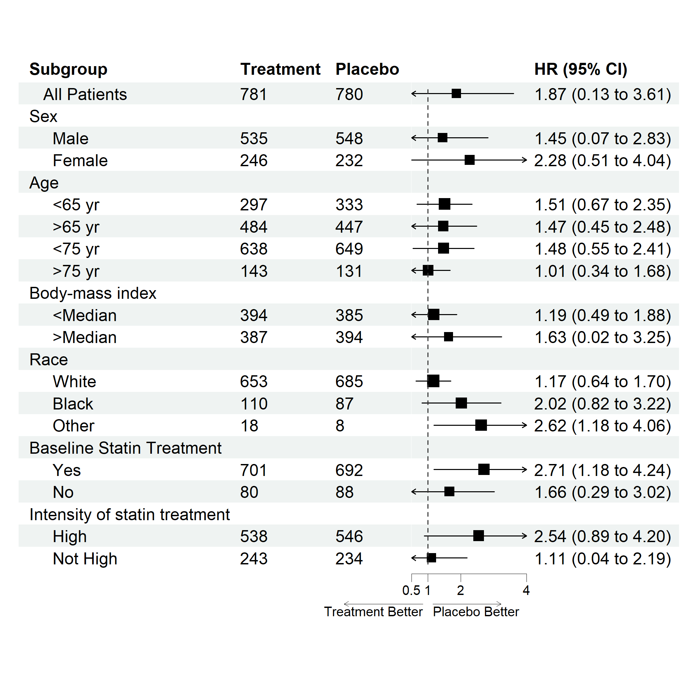
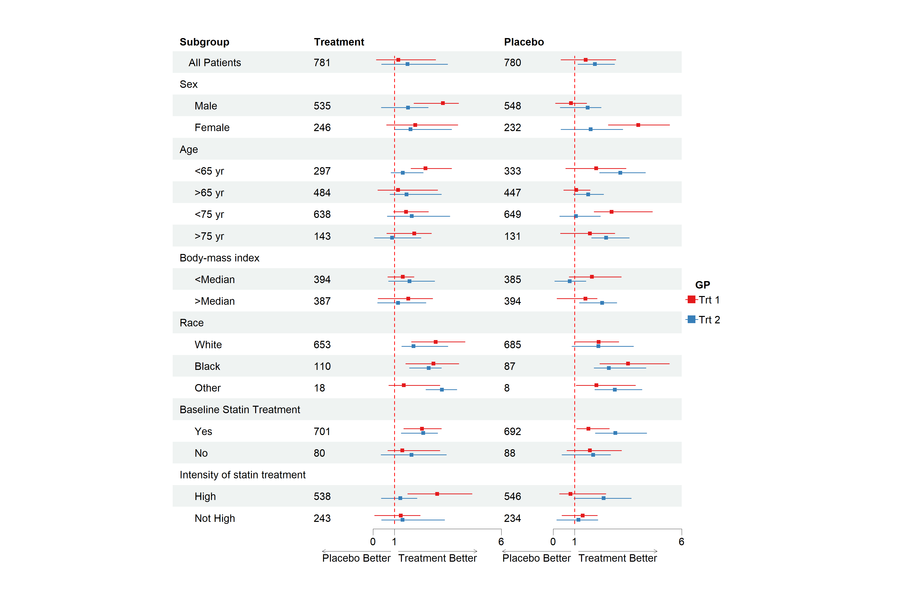

<!-- README.md is generated from README.Rmd. Please edit that file -->

# forestploter

<!-- badges: start -->
<!-- badges: end -->

The goal of `forestploter` is to create a publication-ready forest plot
with little effort. This package provide some extra displays compared to
other packages. The dataset will be used as a basic layout for the
forest plot. Width of the column to draw the confidence interval can be
controlled with the string length of the column. Can use space to
control this. The elements in the plot are put in the row and columns,
think the plot as a table.

## Installation

You can install the development version of `forestploter` from
[GitHub](https://github.com/adayim/forestploter) with:

``` r
# install.packages("devtools")
devtools::install_github("adayim/forestploter")
```

## Basic usage

The column names of the provided data will be used as the header. This
is a basic example which shows you how to create a `forestplot`:

``` r
library(grid)
library(forestploter)

dt <- read.csv(system.file("extdata", "example_data.csv", package = "forestploter"))

# indent the subgroup if there is a number in the placebo column
dt$Subgroup <- ifelse(is.na(dt$Placebo), 
                      dt$Subgroup,
                      paste0("   ", dt$Subgroup))

# NA to blank
dt$Treatment <- ifelse(is.na(dt$Treatment), "", dt$Treatment)
dt$Placebo <- ifelse(is.na(dt$Placebo), "", dt$Placebo)
dt$se <- (log(dt$hi) - log(dt$est))/1.96

# Add blank column for the forest plot to display CI.
# Adjust the column width with space. 
dt$` ` <- paste(rep(" ", 20), collapse = " ")

# Create confidence interval column to display
dt$`HR (95% CI)` <- ifelse(is.na(dt$se), "",
                             sprintf("%.2f (%.2f to %.2f)",
                                     dt$est, dt$low, dt$hi))

# Define theme
tm <- forest_theme(base_size = 10,
                   refline_col = "red",
                   footnote_col = "blue")

p <- forest(dt[,c(1:3, 20:21)],
            est = dt$est,
            lower = dt$low, 
            upper = dt$hi,
            sizes = dt$se,
            ci_column = 4,
            ref_line = 1,
            arrow_lab = c("Placebo Better", "Treatment Better"),
            xlim = c(0, 4),
            xaxis = set_xaxis(c(0.5, 1, 2, 3)),
            footnote = "This is the demo data. Please feel free to change\nanything you want.",
            theme = tm)

# Print plot
plot(p)
```



## Editting plot

Sometimes one may want to change the color or font face of some columns.
Or one may want to insert text into certain rows. Or may want an
underline to separate by group. The function `edit_plot`, `add_text`,
`insert_text` and `add_underline` can achieve these. Below is how to do
this:

``` r
# Edit text in row 3
g <- edit_plot(p, row = 3, gp = gpar(col = "red", fontface = "italic"))

# Bold grouping text
g <- edit_plot(g,
               row = c(2, 5, 10, 13, 17, 20),
               gp = gpar(fontface = "bold"))

# Insert text at top
g <- insert_text(g,
                 text = "Treatment group",
                 col = 2:3,
                 part = "header",
                 gp = gpar(fontface = "bold"))

# Add underline at the bottom of the header
g <- add_underline(g, part = "header")

# Edit background of row 5
g <- edit_plot(g, row = 5, which = "background",
               gp = gpar(fill = "darkolivegreen1"))

# Insert text
g <- insert_text(g,
                 text = "This is a long text. Age and gender summarised above.\nBMI is next",
                 row = 10,
                 just = "left",
                 gp = gpar(cex = 0.6, col = "green", fontface = "italic"))

plot(g)
```


Remember to add 1 to the row number if you have inserted any text
before. The row number will be changed after inserting a text.

## Complex usage

If you want to draw CI to multiple columns, only need to provide a
vector of the position of the columns to be drawn in the data. As seen
in the example below, the CI will be drawn in the column 3 and 5. The
first and second `est`, `lower` and `upper` will be drawn in column 3
and column 5.

For a more complex example, you may want to draw CI by groups. The
solution is simple, just provide another set of `est`, `lower` and
`upper`. If the number of provided `est`, `lower` and `upper` are larger
than the column number to draw CI, then the `est`, `lower` and `upper`
will be reused. As it is shown in the example below, `est_gp1` and
`est_gp2` will be drawn in column 3 and column 5 as normal. But
`est_gp3` and `est_gp4` hasn’t been used, those will be drawn to column
3 and column 5 again. So, the `est_gp1` and `est_gp2` will be considered
as group 1, `est_gp3` and `est_gp4` group 2.

This is an example of multiple CI columns and groups:

``` r
# Add blank column for the second CI column
dt$`   ` <- paste(rep(" ", 20), collapse = " ")

# Set-up theme
tm <- forest_theme(base_size = 10,
                   refline_col = "red",
                   footnote_col = "blue",
                   legend_name = "GP",
                   legend_value = c("Trt 1", "Trt 2"))

p <- forest(dt[,c(1:2, 20, 3, 22)],
            est = list(dt$est_gp1,
                       dt$est_gp2,
                       dt$est_gp3,
                       dt$est_gp4),
            lower = list(dt$low_gp1,
                         dt$low_gp2,
                         dt$low_gp3,
                         dt$low_gp4), 
            upper = list(dt$hi_gp1,
                         dt$hi_gp2,
                         dt$hi_gp3,
                         dt$hi_gp4),
            ci_column = c(3, 5),
            ref_line = 1,
            arrow_lab = c("Placebo Better", "Treatment Better"),
            nudge_y = 0.2,
            theme = tm)

plot(p)
```



# TODO

-   [ ] Expose more parameters, but keep it simple. Maybe treat it as a
    theme.
-   [ ] More documentation
-   [ ] Different point estimation symbols allow for different
    estimation type.
-   [ ] Need some testing.
