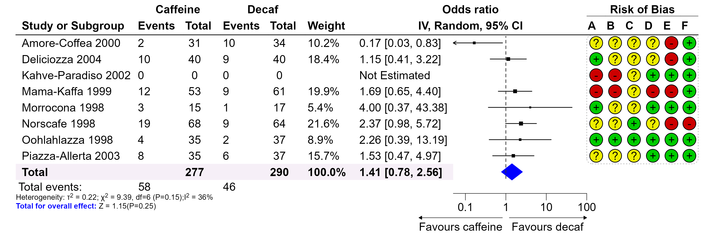
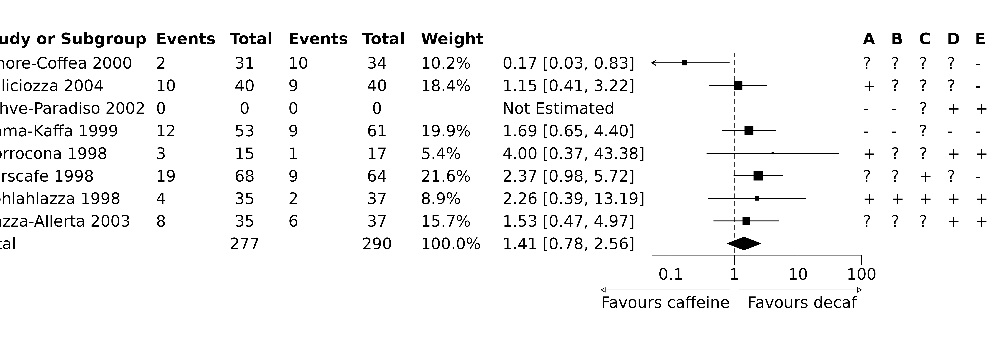
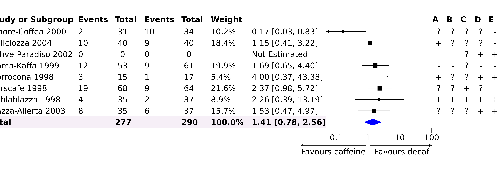
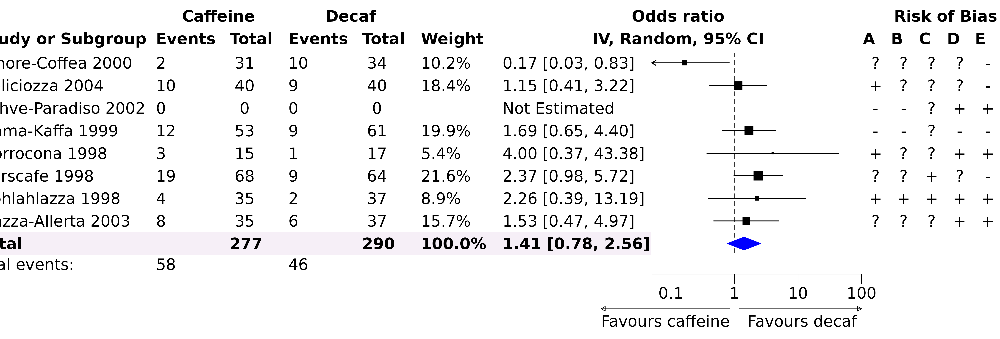
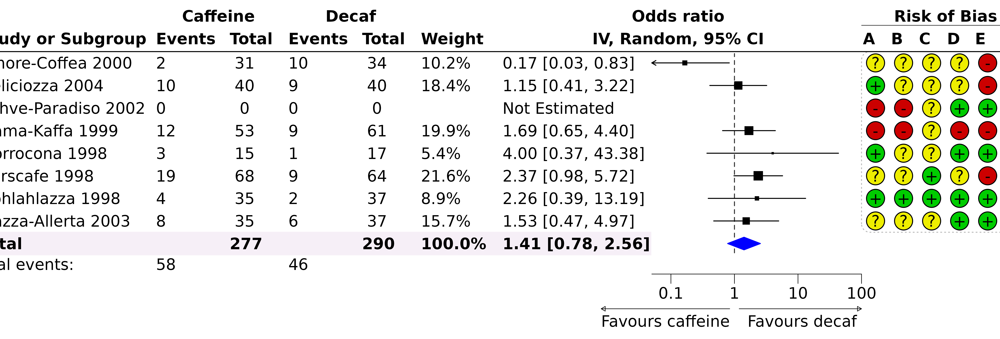
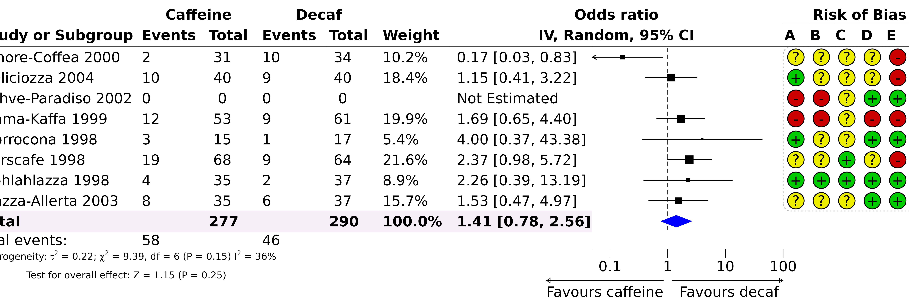
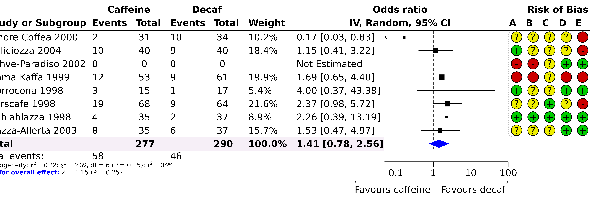

# Post-editing Forest Plot

## Post-editing a Forest Plot

The `forestploter` package creates plots where all elements are placed
in cells. This structure makes it easy to edit any element by specifying
its row and column. This vignette demonstrates how to post-edit a forest
plot to achieve a publication-ready figure.

The plotting steps demonstrated in this vignette may not necessarily be
optimal. There are other R packages that may be better suited for the
plots demonstrated here. Please choose the one that best suits your
needs. The final plot is shown below:



## Drawing a Forest Plot

We will start by drawing a forest plot using an example from the
[metafor](https://www.metafor-project.org/doku.php/plots:forest_plot_revman)
package, which is similar to the plot shown above. First, we load the
data and create a simple forest plot.

``` r

library(grid)
library(forestploter)

# Read meta-analysis example data
dt <- read.csv(system.file("extdata", "metadata.csv", package = "forestploter"))

str(dt)
#> 'data.frame':    9 obs. of  16 variables:
#>  $ author : chr  "Amore-Coffea 2000" "Deliciozza 2004" "Kahve-Paradiso 2002" "Mama-Kaffa 1999" ...
#>  $ ai     : int  2 10 0 12 3 19 4 8 NA
#>  $ n1i    : int  31 40 0 53 15 68 35 35 277
#>  $ ci     : int  10 9 0 9 1 9 2 6 NA
#>  $ n2i    : int  34 40 0 61 17 64 37 37 290
#>  $ weights: num  10.19 18.37 NA 19.91 5.37 ...
#>  $ orci   : chr  "0.17 [0.03, 0.83]" "1.15 [0.41, 3.22]" "Not Estimated" "1.69 [0.65, 4.40]" ...
#>  $ rb.a   : chr  "?" "+" "-" "-" ...
#>  $ rb.b   : chr  "?" "?" "-" "-" ...
#>  $ rb.c   : chr  "?" "?" "?" "?" ...
#>  $ rb.d   : chr  "?" "?" "+" "-" ...
#>  $ rb.e   : chr  "-" "-" "+" "-" ...
#>  $ rb.f   : chr  "+" "+" "+" "+" ...
#>  $ est    : num  0.166 1.148 NA 1.691 4 ...
#>  $ lb     : num  0.033 0.409 NA 0.65 0.369 ...
#>  $ ub     : num  0.829 3.219 NA 4.4 43.383 ...

# Prepare a blank column for the CI
dt$cicol <- paste(rep(" ", 20), collapse = " ")

# Select some columns for plotting; this will serve as the skeleton of the forest plot
dt_fig <- dt[, c(1:7, 17, 8:13)]

colnames(dt_fig) <- c("Study or Subgroup",
                      "Events", "Total", "Events", "Total",
                      "Weight",
                      "", "",
                      LETTERS[1:6])

dt_fig$Weight <- sprintf("%0.1f%%", dt_fig$Weight)
dt_fig$Weight[dt_fig$Weight == "NA%"] <- ""

# Convert NA to a blank string
dt_fig[is.na(dt_fig)] <- ""

# Set background to white, summary diamond to black and closed arrows
st <- forest_style(body = gpar(fill = "white"),
                   summary = gpar(col = "black"),
                   arrow_type = "closed",
                   arrow_label_just = "end")

p <- forest(dt_fig,
            est = dt$est,
            lower = dt$lb,
            upper = dt$ub,
            sizes = dt$weights,
            is_summary = c(rep(FALSE, nrow(dt) - 1), TRUE),
            ci_column = 8,
            ref_line = 1,
            style = st) |>
  set_xaxis(x_trans = "log",
            xlim = c(0.05, 100),
            ticks_at = c(0.1, 1, 10, 100)) |>
  set_labs(arrow = c("Favours caffeine", "Favours decaf")) |>
  # Read the sizes as study weights
  scale_sizes(method = "range")
p
```



## Editing the Forest Plot

The `forestploter` package provides several functions to modify a forest
plot. These functions allow you to edit various aspects of the plot:

- `edit_plot`: Changes the graphical parameters of text, backgrounds,
  and CIs (e.g., the color or font face of specific cells).
- `add_text`: Adds text to specific rows and columns. This is useful for
  complex text alignment, as you can leave some rows or columns blank
  and then add text to them.
- `insert_text`: Inserts a row and adds text before or after a specified
  row. This is useful for inserting text between groups.
- `add_border`: Adds a border to specific cells.
- `add_grob`: Adds various graphical objects (grobs) to the plot.

They take the plot as their first argument and can be chained with the
pipe `|>`. Rows and columns refer to the plot as it is when the function
is called.
[`set_xaxis()`](https://adayim.github.io/forestploter/reference/set_xaxis.md),
[`set_labs()`](https://adayim.github.io/forestploter/reference/set_labs.md),
[`scale_sizes()`](https://adayim.github.io/forestploter/reference/scale_sizes.md)
and
[`set_style()`](https://adayim.github.io/forestploter/reference/set_style.md)
build the plot again, so they must be used before any of these editing
functions.

### Editing the Plot

Below, we will make the “Total” row text bold, change the color of the
diamond shape, and modify the background color of the “Total” row. We
will also align the text in the last six columns to the center.

``` r

g <- p |>
  # Change font face
  edit_plot(row = 9,
            gp = gpar(fontface = "bold")) |>
  # Change color
  edit_plot(col = 8, row = 9, which = "ci",
            gp = gpar(col = "blue", fill = "blue")) |>
  # Change the background of the total row
  # You need to change both fill and col if you don't want to see a gap between cells
  edit_plot(col = 1:7,
            row = 9,
            which = "background",
            gp = gpar(fill = "#f6eff7", col = "#f6eff7")) |>
  # Align text to center
  edit_plot(col = 9:14,
            which = "text",
            hjust = unit(0.5, "npc"),
            x = unit(0.5, "npc"))
g
```



For text alignment: - `hjust = unit(0, "npc")` and `x = unit(0, "npc")`
align text to the left. - `hjust = unit(0.5, "npc")` and
`x = unit(0.5, "npc")` center-align text. - `hjust = unit(1, "npc")` and
`x = unit(0.9, "npc")` align text to the right.

### Adding and Inserting Text

In this step, we will add text to the header and display the total
number of events from the data.

``` r

# Add or insert some text to the header on top of CI columns
g <- add_text(g, text = "IV, Random, 95% CI",
              part = "header", 
              col = 7:8,
              gp = gpar(fontface = "bold"))

g <- insert_text(g, text = "Odds ratio",
                 part = "header", 
                 col = 7:8,
                 gp = gpar(fontface = "bold"))

# Group outcomes
g <- add_text(g, text = "Caffeine",
              part = "header",
              row = 1,
              col = 2:3,
              gp = gpar(fontface = "bold"))

g <- add_text(g, text = "Decaf",
              part = "header", 
              row = 1,
              col = 4:5,
              gp = gpar(fontface = "bold"))

# Add text on the top of the risk of bias data
g <- add_text(g, text = "Risk of Bias",
              part = "header", 
              row = 1,
              col = 9:14,
              gp = gpar(fontface = "bold"))

# Insert event count
g <- insert_text(g, 
                 text = c("Total events:"),
                 row = 9,
                 col = 1,
                 before = FALSE,
                 just = "left")

# Note: The row counts need to add one to account for 
# `insert_text` in the previous step
g <- add_text(g, text = "58",
              col = 2,
              row = 10,
              just = "left")

g <- add_text(g, text = "46",
              col = 4,
              row = 10,
              just = "left")

g
```



### Adding Borders

In this step, we will add borders to the header. By default,
`add_border` adds a border to the bottom of the specified cell(s).

``` r

# Add or insert some text to the header
g <- add_border(g, 
                part = "header", 
                row = 1,
                col = 9:14,
                gp = gpar(lwd = .5))

g <- add_border(g, 
                part = "header", 
                row = 2,
                gp = gpar(lwd = 1))

g
```


### Adding Grobs

In the next step, we will add a rounded rectangle with a dashed line
around the risk of bias data. Then, we will draw circle grobs with
different colors at the bottom of the text.

``` r

g <- add_grob(g,
              row = 1:(nrow(dt_fig) - 1),
              col = 9:14,
              order = "background",
              gb_fn = roundrectGrob,
              r = unit(0.05, "snpc"),
              gp = gpar(lty = "dotted",
                        col = "#bdbdbd"))

# Draw a circle grob; you can also draw a `pointsGrob`
cols <- c("#eeee00", "#00cc00", "#cc0000")
symb <- c("?", "+", "-")
for(i in seq_along(symb)){
  pos <- which(dt_fig == symb[i], arr.ind = TRUE)
  for(j in 1:nrow(pos)){
    g <- add_grob(g, 
                  row = pos[j, 1], 
                  col = pos[j, 2],
                  order = "background",
                  gb_fn = circleGrob,
                  r = 0.4,
                  gp = gpar(fill = cols[i]))
  }
}

g
```



The text we want to create involves math expressions and multiple lines.
While this can be done with `add_text` by setting `parse = TRUE`, we can
use the code below to achieve our desired result. The line break is
based on a solution found
[here](https://stackoverflow.com/questions/18237134/line-break-in-expression),
which uses the `atop` function. You can also use the
[latex2exp](https://CRAN.R-project.org/package=latex2exp) package for
math expressions.

``` r

txt <- bquote(atop(paste("Heterogeneity: ", tau^2, " = 0.22; ",
                         chi^2, " = 9.39, df = 6 (P = 0.15) ",
                         I^2, " = 36%"),
            "Test for overall effect: Z = 1.15 (P = 0.25)"))

add_text(g, text = txt,
         col = 1:6,
         row = 11,
         just = "left",
         parse = TRUE,
         gp = gpar(fontsize = 8))
```



As you can see, the second line is not left-aligned. To address this, we
can use `add_grob` to leverage other packages that create `grob`
objects. In this case, we will use the
[gridmicrotex](https://CRAN.R-project.org/package=gridmicrotex) package,
which renders LaTeX directly as `grid` grobs without requiring a LaTeX
installation. More details about this package can be found
[here](https://adayim.github.io/gridmicrotex/). Passing the LaTeX string
through `latex_grob` or markdown with `markdown_grob` gives us both the
math expressions and full control over the line breaks.

With `input_mode = "math"` the whole string is treated as math, so `\\`
starts a new line and `\text{}` marks the parts that should be typeset
as prose rather than math. Both lines are flush left, which is what we
were after. Individual pieces can be styled with the usual LaTeX
commands, such as `\textcolor` and `\textbf`. Note that `%` is a comment
character in LaTeX and must be escaped as `\%`. Using an R raw string
(`r"(...)"`) avoids having to double every backslash.

``` r

txt <- r"(Heterogeneity: $\tau^2 = 0.22$; $\chi^2 = 9.39$, df = 6 (P = 0.15); $I^2 = 36\%$
\textcolor{blue}{\textbf{Test for overall effect:}} Z = 1.15 (P = 0.25))"

add_grob(g,
         row = 11,
         col = 1:6,
         order = "background",
         gb_fn = gridmicrotex::latex_grob,
         tex = txt,
         gp = gpar(fontsize = 8),
         hjust = 0, vjust = 1,
         x = unit(0, "npc"), y = unit(1, "npc"))
```



We use `render_mode = "path"` here, which draws the symbols as filled
vector outlines and works on every graphics device. The default,
`render_mode = "typeface"`, draws them as real text and keeps the
formula selectable in SVG and PDF output, but it requires a device with
glyph support such as
[`ragg::agg_png`](https://ragg.r-lib.org/reference/agg_png.html),
`svglite::svglite`, or
[`grDevices::cairo_pdf`](https://rdrr.io/r/grDevices/cairo.html).
