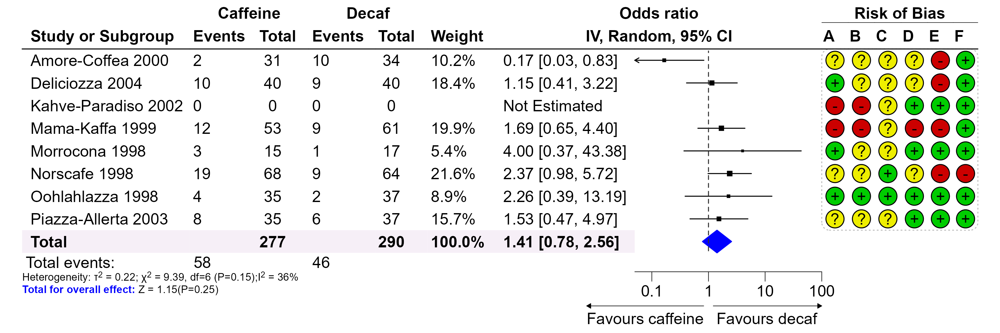

```{r, include = FALSE}
knitr::opts_chunk$set(
  collapse = TRUE,
  dpi = 300,
  comment = "#>"
)
```

# Principle

The layout of the forest plot is determined by the dataset provided. All elements of the forest plot are placed in cells, making it easy to edit any element in the plot given its row and column. The graphical parameters of each element can be further customized in its respective cell. Here, we will start with a simple meta-analysis forest plot.

The plotting steps demonstrated in this vignette may not necessarily be optimal. There are other R packages that may be better suited for the plots demonstrated here. Please choose the one that best suits your needs. The final plot is shown below:

```{r final-plot, out.width = '95%', echo = FALSE}

```

# Drawing a Forest Plot

We will start by drawing a forest plot using an example from [metafor](https://www.metafor-project.org/doku.php/plots:forest_plot_revman), which is similar to the plot above. First, we load the data and draw a simple forest plot.

```{r meta-forest, out.width="95%", fig.width = 10.6, fig.height = 3.6}
library(grid)
library(forestploter)

# Read meta-analysis example data
dt <- read.csv(system.file("extdata", "metadata.csv", package = "forestploter"))

str(dt)

# Prepare a blank column for the CI
dt$cicol <- paste(rep(" ", 20), collapse = " ")

# Select some columns for plotting; this will serve as the skeleton of the forest plot
dt_fig <- dt[, c(1:7, 17, 8:13)]

colnames(dt_fig) <- c("Study or Subgroup",
                      "Events", "Total", "Events", "Total",
                      "Weight",
                      "", "",
                      LETTERS[1:6])

dt_fig$Weight <- sprintf("%0.1f%%", dt_fig$Weight)
dt_fig$Weight[dt_fig$Weight == "NA%"] <- ""

# Convert NA to a blank string
dt_fig[is.na(dt_fig)] <- ""

# Set background to white and summary diamond to black
tm <- forest_theme(core = list(bg_params = list(fill = c("white"))),
                   summary_col = "black",
                   arrow_label_just = "end",
                   arrow_type = "closed")

p <- forest(dt_fig,
            est = dt$est,
            lower = dt$lb, 
            upper = dt$ub,
            sizes = sqrt(dt$weights / 100),
            is_summary = c(rep(FALSE, nrow(dt) - 1), TRUE),
            ci_column = 8,
            ref_line = 1,
            x_trans = "log",
            arrow_lab = c("Favours caffeine", "Favours decaf"),
            xlim = c(0.05, 100),
            ticks_at = c(0.1, 1, 10, 100),
            theme = tm)
p
```

# Editing the Forest Plot

The package provides several functions to modify the forest plot. Below are the functions to edit various aspects of the plot:

- `edit_plot`: Used to change graphical parameters of text, background, and CI (e.g., color or font face of specific cells).
- `add_text`: Adds text to specific rows/columns. For complex text alignment, leave some rows/columns blank and use this function.
- `insert_text`: Inserts a row before or after a specific row and adds text. Useful for inserting text between groups.
- `add_border`: Adds a border to specific cells.
- `add_grob`: Adds different graphical objects (grobs).

## Editing the Plot

Below, we make the total row text bold, change the color of the diamond shape, and modify the background color of the total row. We also align text in the last six columns to the center.

```{r edit-metaplot, out.width="95%", fig.width = 10.6, fig.height = 3.6}
# Change font face
g <- edit_plot(p, row = 9, 
               gp = gpar(fontface = "bold"))

# Change color
g <- edit_plot(g, col = 8, row = 9, which = "ci", 
               gp = gpar(col = "blue", fill = "blue"))

# Change the background of the total row
g <- edit_plot(g, col = 1:7, 
               row = 9, 
               which = "background", 
               gp = gpar(fill = "#f6eff7"))

# Align text to center
g <- edit_plot(g, col = 9:14, 
               which = "text",
               hjust = unit(0.5, "npc"),
               x = unit(0.5, "npc"))
g
```

For text alignment:
- `hjust = unit(0, "npc")` and `x = unit(0, "npc")` align text to the left.
- `hjust = unit(0.5, "npc")` and `x = unit(0.5, "npc")` center-align text.
- `hjust = unit(1, "npc")` and `x = unit(0.9, "npc")` align text to the right.

## Adding and Inserting Text

In this step, we add some text to the header and total number of events in the data.

```{r text-metaplot, out.width="95%", fig.width = 10.6, fig.height = 3.6}
# Add or insert some text to the header on top of CI columns
g <- add_text(g, text = "IV, Random, 95% CI",
              part = "header", 
              col = 7:8,
              gp = gpar(fontface = "bold"))

g <- insert_text(g, text = "Odds ratio",
                 part = "header", 
                 col = 7:8,
                 gp = gpar(fontface = "bold"))

# Group outcomes
g <- add_text(g, text = "Caffeine",
              part = "header",
              row = 1,
              col = 2:3,
              gp = gpar(fontface = "bold"))

g <- add_text(g, text = "Decaf",
              part = "header", 
              row = 1,
              col = 4:5,
              gp = gpar(fontface = "bold"))

# Add text on the top of the risk of bias data
g <- add_text(g, text = "Risk of Bias",
              part = "header", 
              row = 1,
              col = 9:14,
              gp = gpar(fontface = "bold"))

# Insert event count
g <- insert_text(g, 
                 text = c("Total events:"),
                 row = 9,
                 col = 1,
                 before = FALSE,
                 just = "left")

# Note: The row counts need to add one to account for 
# `insert_text` in the previous step
g <- add_text(g, text = "58",
              col = 2,
              row = 10,
              just = "left")

g <- add_text(g, text = "46",
              col = 4,
              row = 10,
              just = "left")

g
```

## Adding Borders

In the next step, we add some borders to the header. The default is to add a border at the bottom of the cell(s).

```{r border-metaplot, out.width="95%", fig.width = 10.6, fig.height = 3.6}
# Add or insert some text to the header
g <- add_border(g, 
                part = "header", 
                row = 1,
                col = 9:14,
                gp = gpar(lwd = .5))

g <- add_border(g, 
                part = "header", 
                row = 2,
                gp = gpar(lwd = 1))

g
```

## Adding Grobs

In the next step, we add a rounded rectangle border with a dashed line around the risk of bias data. Then, we draw a circle grob with different colors at the bottom of the text.

```{r grob-metaplot, out.width="95%", fig.width = 10.6, fig.height = 3.6}
g <- add_grob(g, 
              row = 1:c(nrow(dt_fig) - 1), 
              col = 9:14,
              order = "background",
              gb_fn = roundrectGrob,
              r = unit(0.05, "snpc"),
              gp = gpar(lty = "dotted",
                        col = "#bdbdbd"))

# Draw a circle grob; you can also draw a `pointsGrob`
cols <- c("#eeee00", "#00cc00", "#cc0000")
symb <- c("?", "+", "-")
for(i in seq_along(symb)){
  pos <- which(dt_fig == symb[i], arr.ind = TRUE)
  for(j in 1:nrow(pos)){
    g <- add_grob(g, 
                  row = pos[j, 1], 
                  col = pos[j, 2],
                  order = "background",
                  gb_fn = circleGrob,
                  r = 0.4,
                  gp = gpar(fill = cols[i]))
  }
}

g
```

The text we are going to create involves math expressions and multiple lines. Any one of these can easily be done with `add_text` and setting `parse = TRUE`. We can use the code below to achieve what we want. The line break below is based on the solution [here](https://stackoverflow.com/questions/18237134/line-break-in-expression) using the `atop` function. You can also use the [latex2exp](https://CRAN.R-project.org/package=latex2exp) package for math expressions.

```{r txtgrob-metaplot, out.width="95%", fig.width = 10.6, fig.height = 3.6}
txt <- bquote(atop(paste("Heterogeneity: ", tau^2, " = 0.22; ",
                         chi^2, " = 9.39, df = 6 (P = 0.15) ",
                         I^2, " = 36%"),
            "Total for overall effect: Z = 1.15 (P = 0.25)"))

add_text(g, text = txt,
         col = 1:6,
         row = 11,
         just = "left",
         parse = TRUE,
         gp = gpar(fontsize = 8))
```

We can see that the second line is not left-aligned. We can use `add_grob` to take advantage of other packages that create `grobs` objects. Now we will use the [gridtext](https://CRAN.R-project.org/package=gridtext) package to generate complex text and add it to the plot with `add_grob`. More details about the package can be found [here](https://wilkelab.org/gridtext/index.html). You can write markdown or HTML text and render it to the plot. Currently, it does not support math equations. See other Unicode math symbols [here](https://www.stat.auckland.ac.nz/~paul/R/CM/AdobeSym.html).

```{r gridtext-metaplot, out.width="95%", fig.width = 10.6, fig.height = 3.6}
txt <- "Heterogeneity: &tau;<sup>2</sup> = 0.22; &chi;<sup>2</sup> = 9.39,
df = 6 (P = 0.15); I<sup>2</sup> = 36%<br><span style='color:blue'>**Total for overall effect:**</span> Z = 1.15 (P = 0.25)"

add_grob(g, 
         row = 11, 
         col = 1:6,
         order = "background",
         gb_fn = gridtext::richtext_grob,
         text = txt,
         gp = gpar(fontsize = 8),
         hjust = 0, vjust = 1, halign = 0, valign = 1,
         x = unit(0, "npc"), y = unit(1, "npc"))
```


